# 📘 Documentação Visual – Meet2IC

Este guia mostra, com imagens, o funcionamento do sistema **Meet2IC**, utilizado no Instituto de Computação da UNICAMP para criação e resposta de enquetes de disponibilidade.

---

## 🔐 1. Tela de Login

O usuário acessa a página inicial e encontra a opção de login com Google.

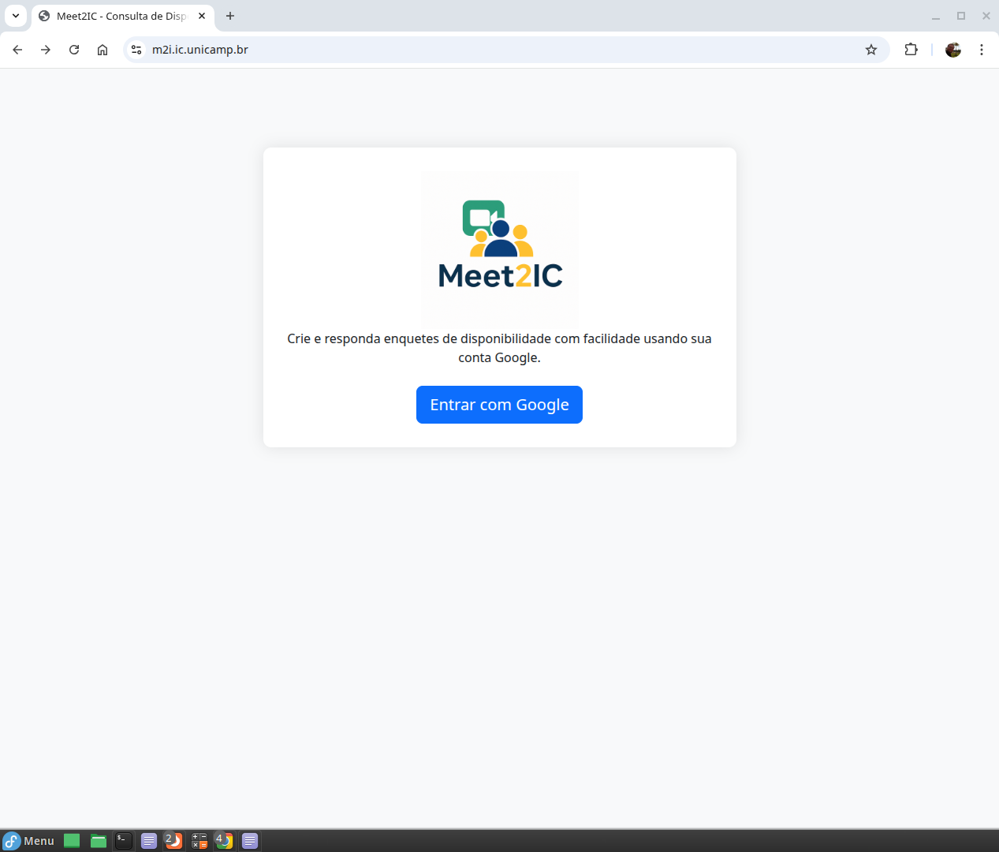

---

## ✅ 2. Autenticação com Google

Processo de autenticação OAuth usando a conta institucional ou pessoal do Google.

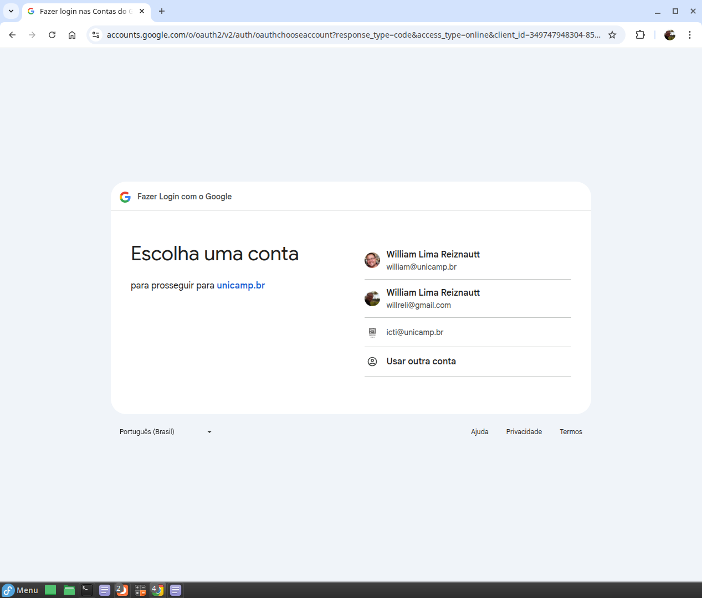

---

## 🗓 3. Criar Enquete

Usuário autenticado pode criar uma enquete informando:
- Título (obrigatório)
- Descrição (opcional)
- Horários disponíveis

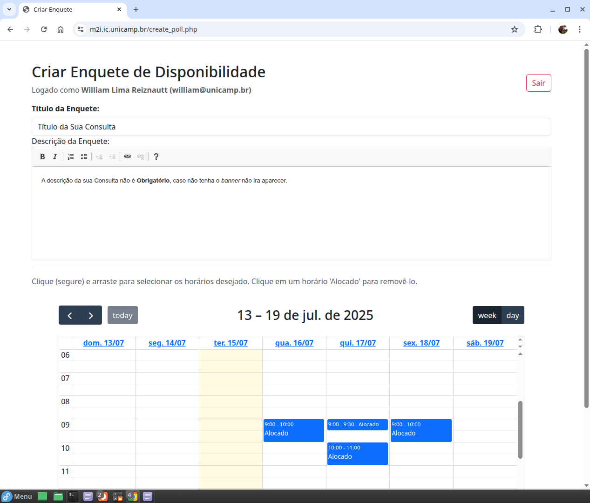

---

## 🗑 4. Excluir Horário Adicionado por Engano

É possível remover horários adicionados por engano antes de finalizar a criação da enquete.

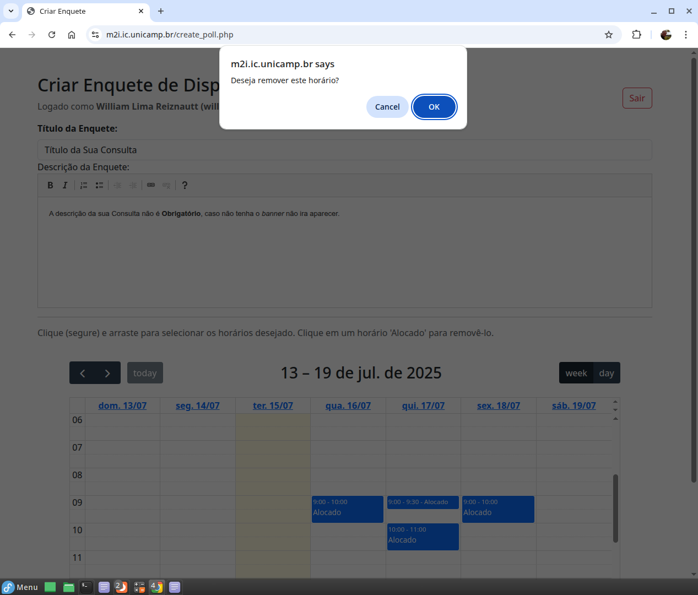

---

## ➕ 5. Criar Enquete

Ao preencher todas as informações, basta clicar no botão para criar a enquete.

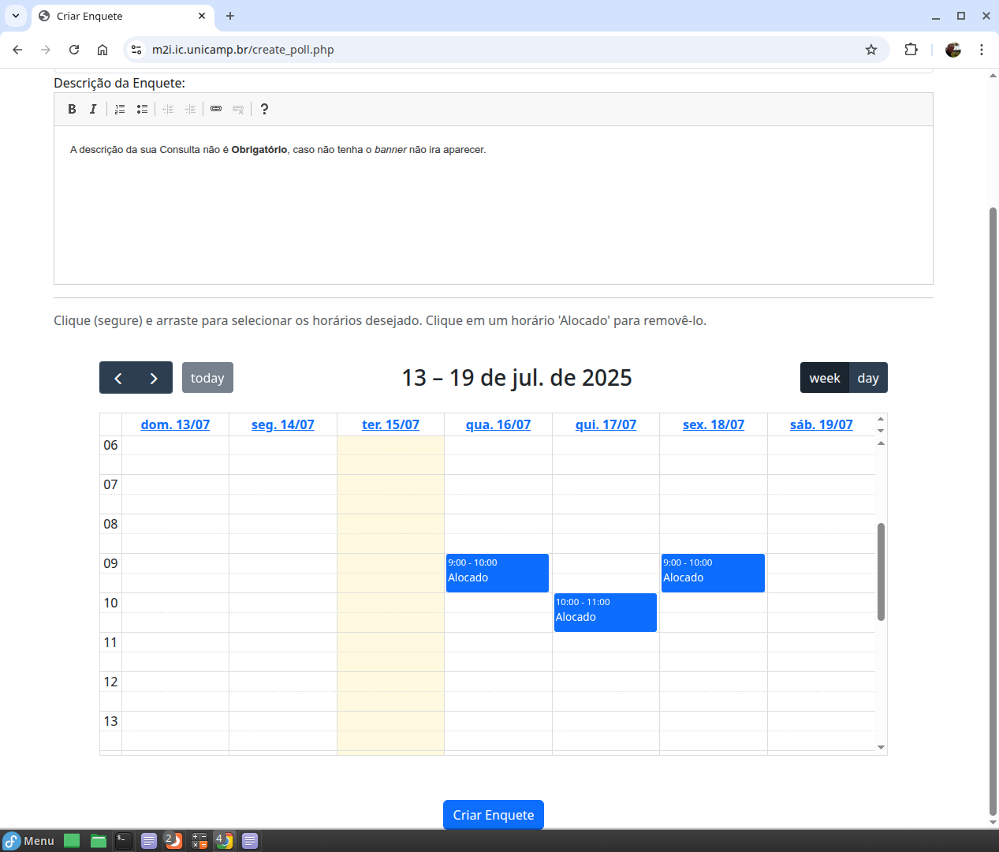

---

## 🔗 6. Link Gerado Após Criação

Um link único é gerado automaticamente e pode ser compartilhado com os participantes.

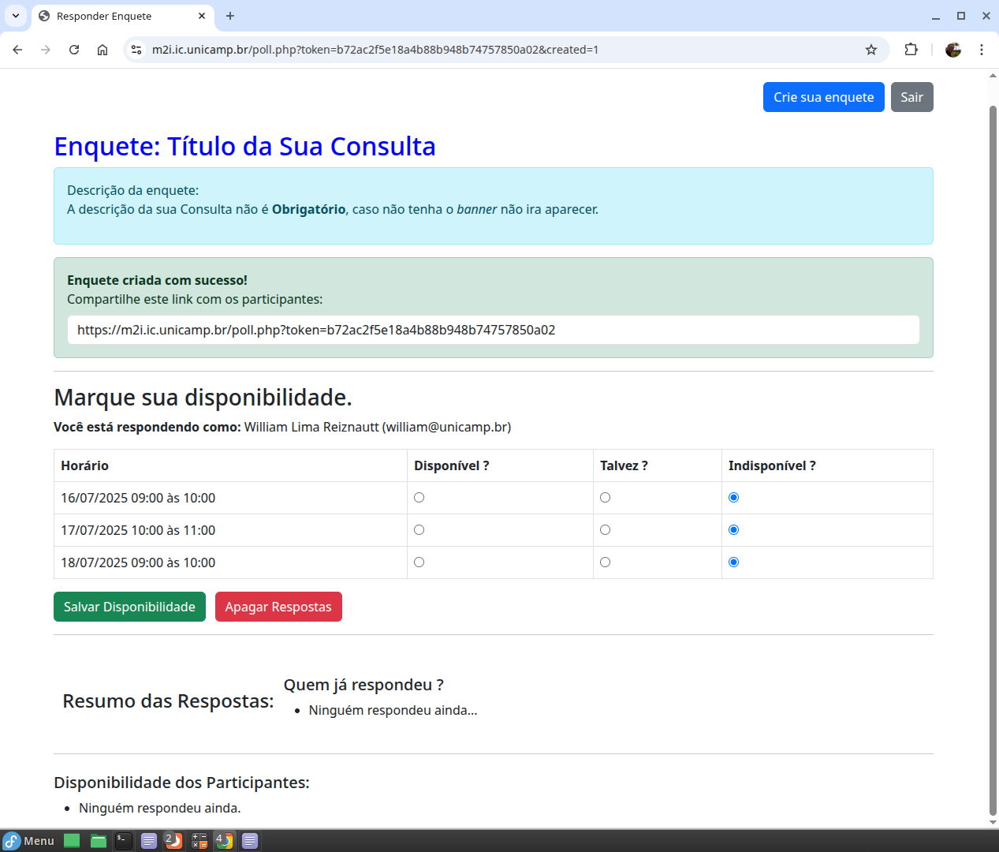

---

## 👥 7. Acesso à Enquete Sem Autenticação

Participantes podem responder à enquete sem fazer login.

---

## ✍️ 8. Responder Sem Estar Logado

Ao acessar o link, o usuário pode informar nome e e-mail e marcar a sua disponibilidade.

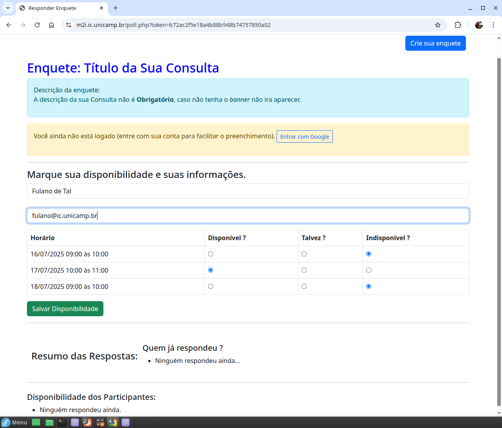

---

## 📊 9. Resumo Após Resposta (Sem Login)

É mostrado um resumo com as escolhas de todos, com destaque em verde para o melhor horário.

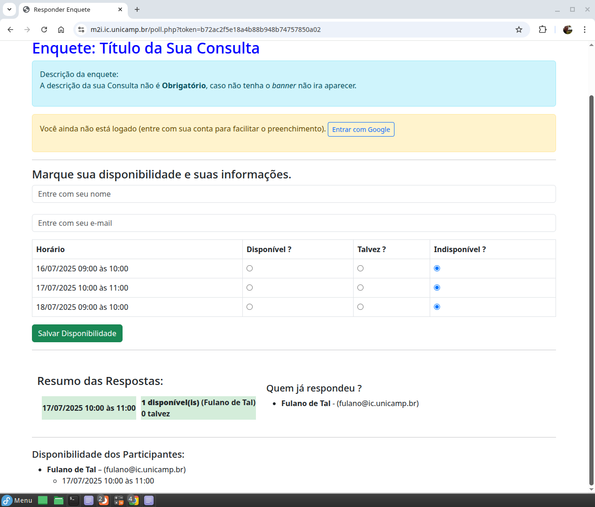

---

## 🔒 10. Responder Estando Autenticado

Usuários logados respondem sem necessidade de preencher nome e e-mail novamente.

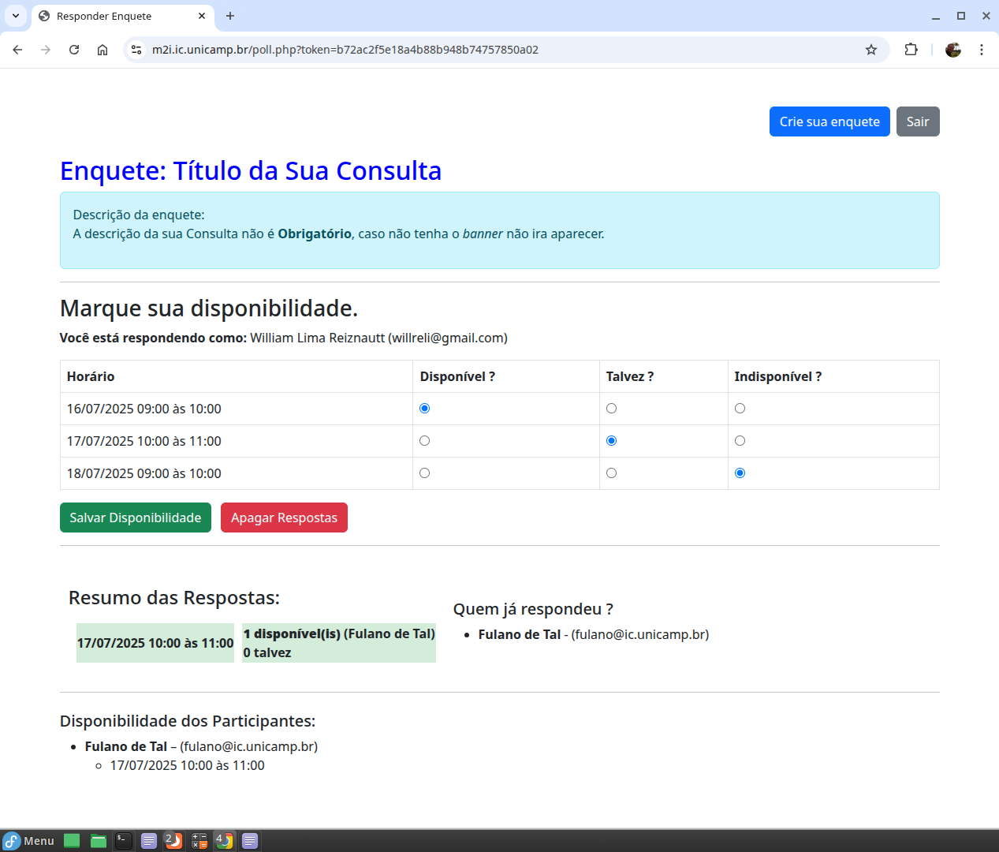

---

## 📈 11. Resumo com Disponibilidade Marcada

Participantes veem os horários escolhidos, com destaque do melhor horário ao final.

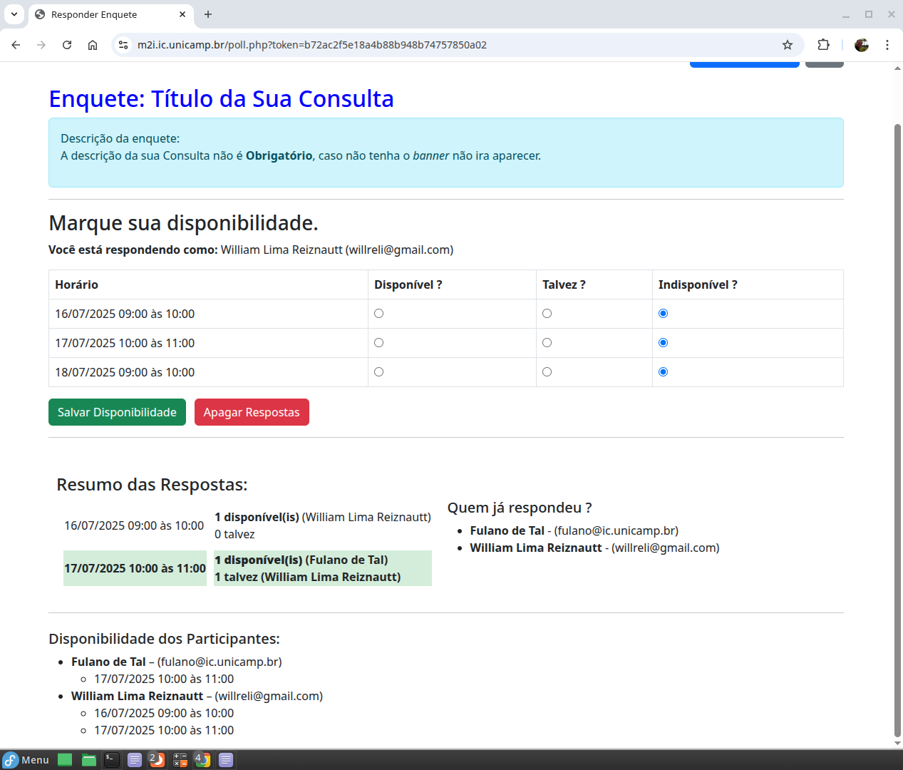

---

## 📧 12 e 13. E-mails Enviados ao Criador

Sempre que alguém interage com a enquete (responde ou modifica), o criador é notificado por e-mail.

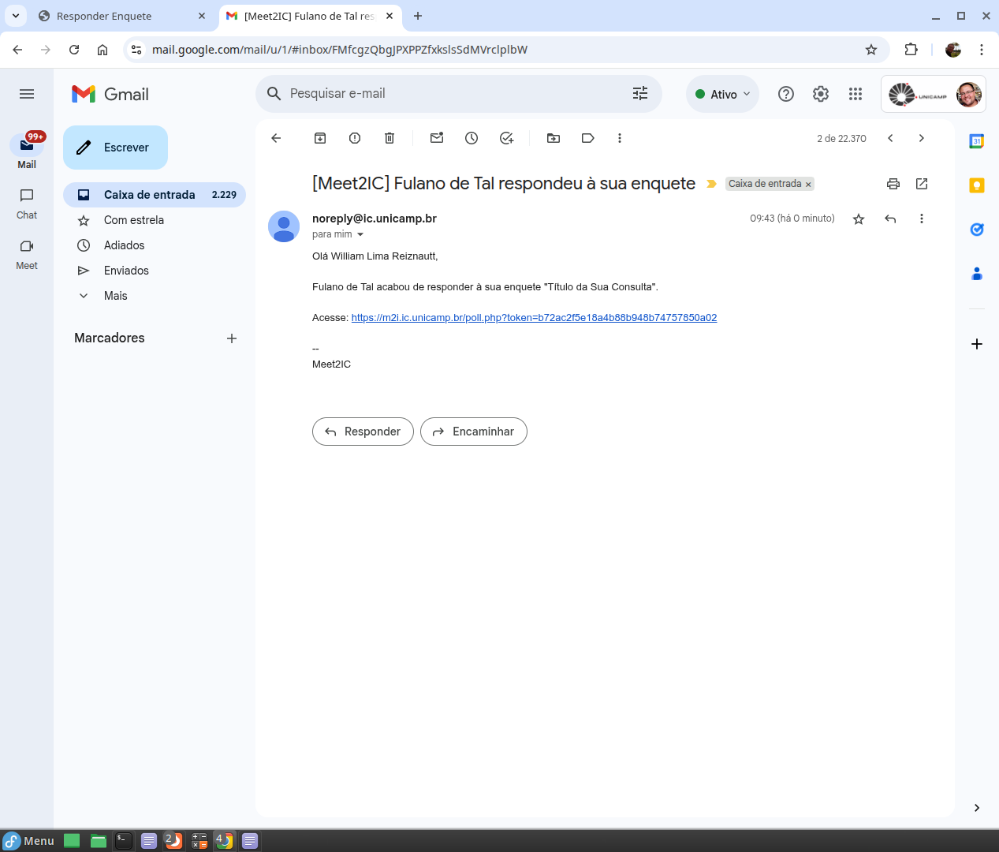  
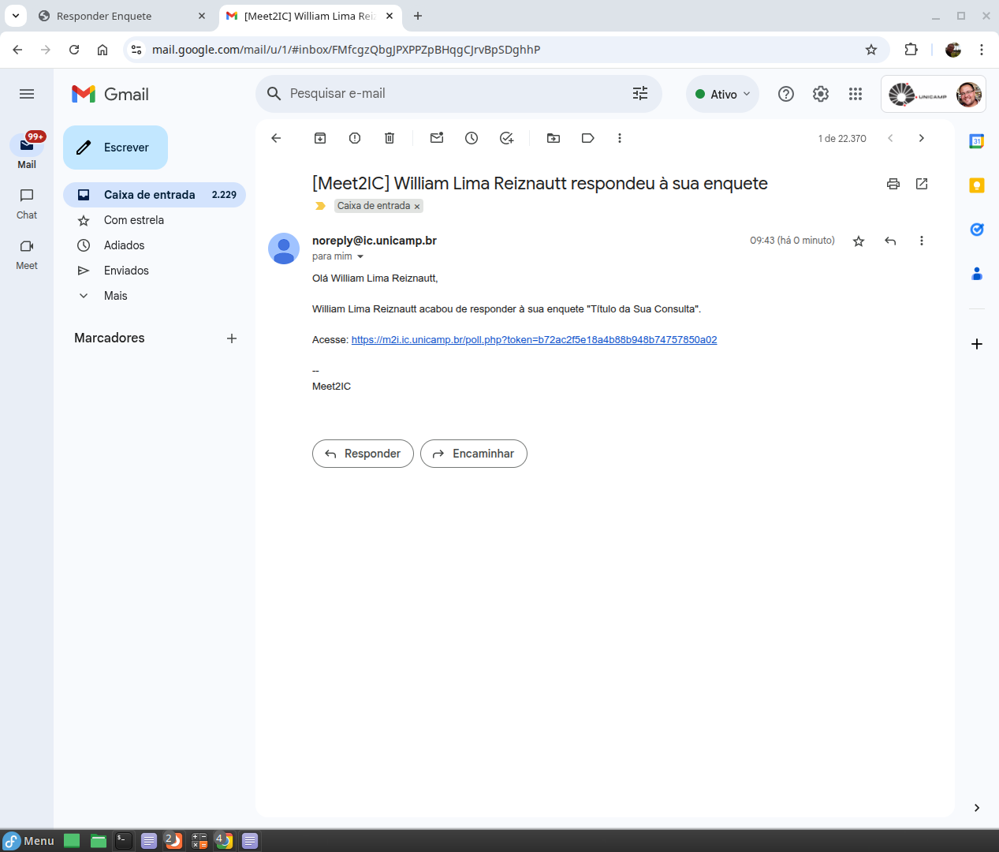

---

## ℹ️ Sobre

> Este sistema é utilizado internamente na UNICAMP (Instituto de Computação) e segue diretrizes de software livre acadêmico, podendo ser adaptado por outras unidades ou qualquer pessoa. Caso implemente uma melhoria, por favor compartilhe conosco.

---

© Instituto de Computação – UNICAMP

